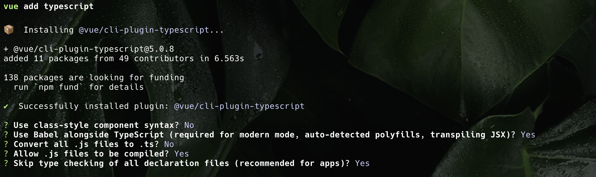
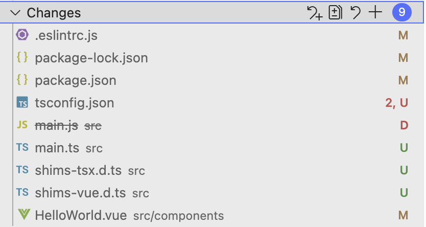

# vue2引入typescript(vue-cli篇)

## 安装typescript相关依赖
通过@vue/cli的`vue add`命令安装，可以自动补充和typescript关联的依赖，避免版本号不对应导致的冲突
```
vue add typescript
```

:::warning
vue add 安装的依赖默认是`最新版本`，可能会和项目中的@vue/cli版本冲突，可以先安装和@vue/cli主版本号一致的@vue/cli-plugin-typescript，这样版本号就会锁定。
例如：项目中的"@vue/cli-service"为"3.9.0"，可以执行`npm i -D @vue/cli-plugin-typescript@3`
:::


选择的配置如下


执行完文件更新如下


实际执行结果可能会不一样，只保留以下几个文件的更改：
1. .eslintrc.js
```js
module.exports = {
  extends: [
    //...
    // 新增typescript扩展
    '@vue/typescript'
  ],
  parserOptions: {
    // 更新解析器，支持ts
    parser: '@typescript-eslint/parser',
  },
};
```
2. package.json

新增了typescript相关的依赖
```json
"devDependencies": {
    "@typescript-eslint/eslint-plugin": "^5.4.0",
    "@typescript-eslint/parser": "^5.4.0",
    "@vue/cli-plugin-typescript": "^5.0.8",
    "@vue/eslint-config-typescript": "^9.1.0",
    "typescript": "~4.5.5",
  }
```
3. package-lock.json

4. tsconfig.json

ts配置文件是新增的，稍微调整一下：

* skipLibCheck设置为false，绕过依赖库的ts检测
```json
{
  "compilerOptions": {
    "skipLibCheck": true,   
  }
}
```
5. shims-tsx.d.ts

jsx声明文件，可在global中补充全局属性
```ts
// shims-tsx.d.ts
import Vue, { VNode } from "vue";

declare global {
  namespace JSX {
    interface Element extends VNode {}
    interface ElementClass extends Vue {}
    interface IntrinsicElements {
      [elem: string]: any;
    }
  }
}
```
6. shims-vue.d.ts

vue实例声明文件
```ts
// shims-vue.d.ts
declare module "*.vue" {
  import Vue from "vue";
  export default Vue;
}
```

### 调整main.js
将main.js该为main.ts，加入@ts-nocheck声明，临时绕过ts检测，后续再完善。
```main.js
// @ts-nocheck
```

:::warning
`vue add typescript`会将main.js文件改为main.ts，大概率会报ts错误，不要应用。
:::


## IDE类型补全(可选)
如果使用了unplugin-vue2-script-setup插件，为了使vue office插件能在template中获取ts类型，需要做以下调整：
1. 安装@vue/runtime-dom
```shell
npm i -D @vue/runtime-dom
or
yarn add -D @vue/runtime-dom
```
2.在tsconfig.json中补充types
```json
{
  "compilerOptions": {
    "types": [
      "unplugin-vue2-script-setup/types"
    ]
  }
}
```

## 总结
1. vue2手动安装typescript插件还是挺麻烦的，特别是需要与eslint兼容，不同版本容易出现冲突，建议使用`vue add typescript`进行自动化处理，然后再进行微调。
2. 使用`unplugin-vue2-script-setup`时，模板上的ts类型推导功能还不够完善，需要搭配`@vue/runtime-dom`使用。


