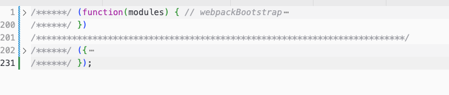
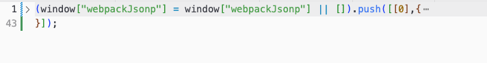

现在普遍使用的前端模块基本就两种类型：[CommonJS](https://nodejs.org/docs/latest-v16.x/api/modules.html) 和 [ESM](https://nodejs.org/docs/latest-v16.x/api/esm.html)，但是细分到各种场景又会有很多注意事项，让我们梳理一下。


# Node.js的模块

先展示一下 Commonjs 和 ESM 的基本用法。
## 示例
### CommonJS

导出使用 `module.exports` 或 `exports`
```js
// utils.js
// 整体导出为一个对象
module.exports = {
  fun: function() { },
  v1: 'xxxx'
}
// exports 为 module.exports 别名，相当于在 module.exports 导出的对象增加属性
exports.bar = function() { }
```

导入使用 `require`
```js
// 只能导入为完整对象
const utils = require('./utils.js')
//使用导入对象的属性
utils.fun()
console.log('v1', utils.v1)
```

### ESM

导出使用 `export`或`export default`。
```js
// utils.js
// 命名导出函数
export function fun() { }
// 命名导出常量
export const v1 = 'xxx'
function test () {
  console.log("test");
}
const v3 = 'zzz';
// 命名导出另一种写法，必须先定义再导出
export {
  test,
  v3
}
// 默认导出，一个只能有一处默认导出。
export default {
  bar: function() { },
  v2: 'yyy'
}
```

导入使用`import`
```js
// 命名导入
import { fun, v1 } from './utils.js'
// 将所有命名导入合并为一个对象
import * obj from './utils.js'
// 默认导入
import utils from './utils.js'

fun()
console.log('v1', v1)

obj.fun()
console.log('v1', obj.v1)

utils.bar()
console.log('v2', utils.v2)
```

## 定义模块类型

那么，CommmonJS和ESM如何在Node.js中使用？
Node.js项目都有`package.json`文件，可以通过`type`属性设置支持的模块类型：
### CommmonJS
```json
{
  "type": "commonjs", // 设置CommmonJS模块，默认值  
}
```
设置为CommmonJS模块时，对于ESM文件，需要将文件后缀改为`mjs`才能导入。使用`动态import`进行导入。
```js
// a.mjs
export default function a() {
  console.log("a");
}
```
```js
//index.js
// CommmonJS为同步导入，ESM为异步导入，所以在CommonJS中导入ESM只能使用异步导入写法
import('./a.mjs').then(a => a.default());
```

### ESM
```json
{
  "type": "module", // 设置ESM模块
}
```
设置为ESM模块时，对于CommmonJS文件，需要将文件后缀改为`cjs`才能导入。使用`import`进行导入。

```js
// a.cjs
function a() {
  console.log("a");
}
module.exports = {
  a
};

```
```js
//index.js
import { a } from "./a.cjs";
a();
```

# Webpack的模块
Webpack的模块系统非常强大，天然支持`ESM模块`、`CommonJS模块`、`AMD模块`、`Assets`和`WebAssembly模块`。

## ESM 和 CommonJS
有以下注意事项：
* Webpack支持ES6 模块，对于更高级的语法，如async/await，需要搭配babel使用。
* package.json的`type`属性缺省时，支持ESM和CommonJS混合使用，使用`import`导入将模块视为`ESM`，使用`require`导入将模块视为`CommonJS`
* 可以通过package.json的`type`属性设置为`module`，所有文件不能出现`require`和`module.exports`等CommonJS语法
* 可以通过package.json的`type`属性设置为`commons`，所有文件不能出现`export`和`import`等ESM语法
* `.mjs`文件视为`ESM`，不能出现CommonJS语法
*  `.cjs`文件视为`CommonJS`，不能出现ESM语法

### ESM模块中导入CommonJS模块
支持在ESM模块中直接`require`CommonJS模块
```js
// utils.js
module.exports = {
  bar: function(){ console.log('bar') }
}
```

```js
// index.js
const utils = require('./utils.js')
utils.bar()
export default { }
```

### CommonJS模块中导入ESM模块
由于ESM模块是异步导入，需要通过动态导入的方式导入ESM模块。
```js
// utils.js
export function bar(){ console.log('bar') }

export default function(){ console.log('utils') }
```
```js
// index.js
function fun(){
  import('./utils.js').then(res => {
    // 默认导出
    res.default()
    // 命名导出
    res.bar()
  })
}
fun()
module.exports = { }
```

## AMD
支持AMD模块的 define 和 require 语句

## Assets
天然支持:
* 支持css/sass/less 文件中的 @import 语句。
* stylesheet `url(...)` 或者 `HTML ` 文件中的图片链接。

还支持通过第三方loader实现对其他非原生模块的处理，比如：
* typescript
* ESNext(Babel)
* sass
* less
* vue单文件组件

# Webpack的构建产物
虽说Webpack支持ESM和CommonJS，但是构建产物如果是运行在浏览器中，就识别不了语法了，所以Webpack会进行转换，用`IIFE`(立即执行函数)实现模块化。

## IIFE
`IIFE`实际上就是利用闭包实现局部作用域，避免污染全局环境。
```js
var module = (function(){
  // val只能在module内部访问
  var val = 'test'
  // show函数只能通过module.show访问
  const show = function(){
    console.log(val)
  }
  return {
    show
  }
})()

module.show()
```

## 示例

### 源代码
先展示几段简单的js代码

index.js文件
```js
// 为了utils构建成当前的chunk文件，这里使用了动态导入
import('./utils').then(({fun})=>{
  fun()
})
```

utils.js文件
```js
import { test } from './test'

test()

export  function fun() {
  console.log('fun')
}
```

test.js文件
```js
export function test() {
  console.log('test')
}
```

### 构建产物
执行以下命令，其中设置`--mode development --devtool false`，是为了提供更好的可读性。
```bash
# 示例使用的是webpack4
npx webpack --entry ./index.js --mode development --devtool false
```

dist目录下输出了`main.js`和`0.js`两个文件。

`main.js`

`0.js`


下面对代码进行优化，只保留主要逻辑，替换成可读性高的函数名称。

`main.js`
```js
// modules包含了所有模块的执行代码
;(function (modules) {
  // 缓存已下载模块的状态: undefined: 未下载, 0: 已下载, 数组([resolve, reject]): 下载中
  var loadMap = {}
  // 缓存已导入模块: 模块id => 模块
  var requireMap = {}

  // 模块下载完成后的回调
  function webpackJsonpCallback(chunkId, moreModules) {
    // 将下载模块的执行代码添加到modules中
    for (var moduleId in moreModules) {
      modules[moduleId] = moreModules[moduleId]
    }
    // 先调用模块下载的resolve函数，再将模块状态设置为0
    loadMap[chunkId][0]()
    loadMap[chunkId] = 0
  }

  // 导入模块代码
  function __webpack_require__(chunkId) {
    if (requireMap[chunkId]) {
      return requireMap[chunkId].exports
    }
    requireMap[chunkId] = {
      chunkId,
      exports: {}
    }
    var module = requireMap[chunkId]
    // 模块导出的内容放到module.exports中
    modules[chunkId].call(
      module.exports,
      module,
      module.exports,
      __webpack_require__
    )
    return module.exports
  }

  // 下载模块脚本，不同chunk的模块需要先下载再导入
  __webpack_require__.load = function (chunkId) {
    // 已下载脚本
    if (loadMap[chunkId] === 0) return
    // 下载脚本，下载后执行脚本会将promise状态设置为resolve
    return new Promise((resolve, reject) => {
      loadMap[chunkId] = [resolve, reject]
      var script = document.createElement('script')
      script.src = `./${chunkId}.js`
      document.head.appendChild(script)
    })
  }

  // 创建全局webpackJsonp对象
  window.webpackJsonp = window.webpackJsonp || []
  // 全局webpackJsonp对象添加callback函数用于模块脚本下载之后调用
  window.webpackJsonp.callback = webpackJsonpCallback
  // 执行当前文件脚本
  return __webpack_require__('main')
})({
  'main': function (module, exports, __webpack_require__) {
    __webpack_require__
      // 下载chunk文件
      .load(0)
      // 导入对应的模块
      .then(() => __webpack_require__('utils'))
      // 执行本模块代码
      .then(({ fun }) => fun())
  }
})
```

`0.js`
```js
window.webpackJsonp.callback(0, {
  'utils': function (module, exports, __webpack_require__) {
    // 导入tes模块
    var testObj = __webpack_require__('test')
    testObj.test()
    
    function fun() {
      console.log('fun')
    }
    // 设置导出函数
    exports.fun = fun
  },
  'test': function (module, exports, __webpack_require__) {
    function test() {
      console.log('test')
    }
    // 设置导出函数
    exports.test = test
  },
})
```

主要做了以下工作，实现构建产物的模块化：

`main.js`是一段IIFE，实现了模块化的主要逻辑
1. 实现`__webpack_require__`函数用于导入模块
2. 实现`__webpack_require__.load`函数用于通过`JSONP`形式下载`chunk`脚本
3. 缓存已下载和已导入的模块，避免重复查询。
4. 定义modules对象，用于存储所有模块的执行代码。
5. 添加全局的`window.webpackJsonp.callback`函数，下载`chunk`脚本之后会执行这个函数，添加新模块的执行代码。
6. IIFE的入参是一个对象，只有main属性，对应的值是index.js文件编译后的代码

`0.js`文件执行了全局的`window.webpackJsonp.callback`函数
1. 第一个入参是函数文件名
2. 第二个入参是一个对象，包含了`utils.js`和`test.js`两个文件编译后的代码

## 总结
可以看出Webpack构建产物的模块化，主要依赖于`IIFE`和`JSONP`两项技术。

 
# Vite的模块
默认情况下，源码只支持ESM，因此构建产物只能运行在支持模块化的现代浏览器。

在开发和生产环境，vite的处理有所差异。

## 开发环境
1. 使用`esbuild`对依赖进行预构建，支持ESM和CommonJS模块的依赖。
2. 源码只在导入时实时编译，根据动态导入拆分`chunk`文件，保证页面只导入所有的文件。
3. 在浏览器上，`index.html`文件通过`<script type="module" .../>` 引入ESM模块，`ESM模块`直接直接通过`import`导入。

## 生产环境
1. 使用rollup一次性编译所有源码。
2. 对于CommonJS的模块，需要用插件预先转换为ESM模块。
3. 在浏览器上，`index.html`文件通过`<script type="module" .../>` 引入ESM模块，`ESM模块`直接直接通过`import`导入。

:::tip
这里的编译，指的是编译`ts`、`.vue`、`.jsx`等文件，默认情况下，js代码是不会编译成`ES5`版本以兼容旧浏览器的。
:::


